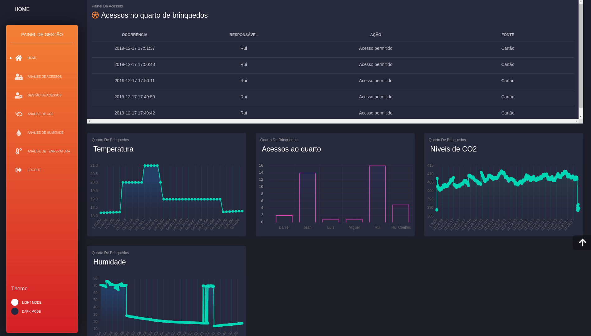
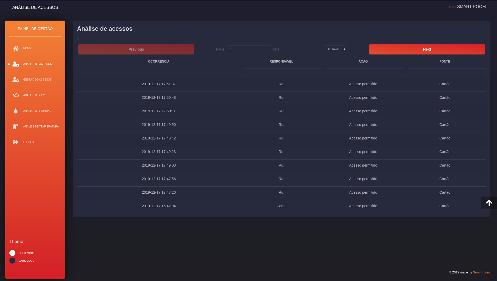
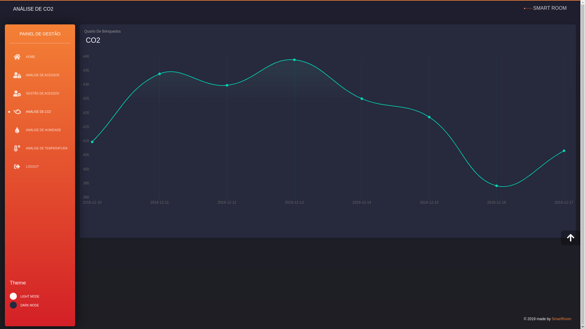
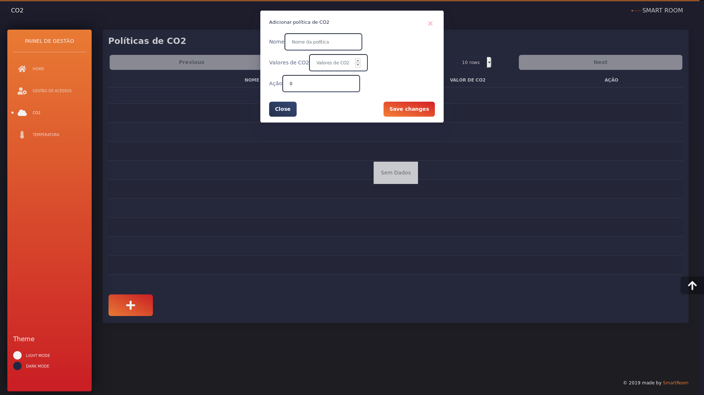
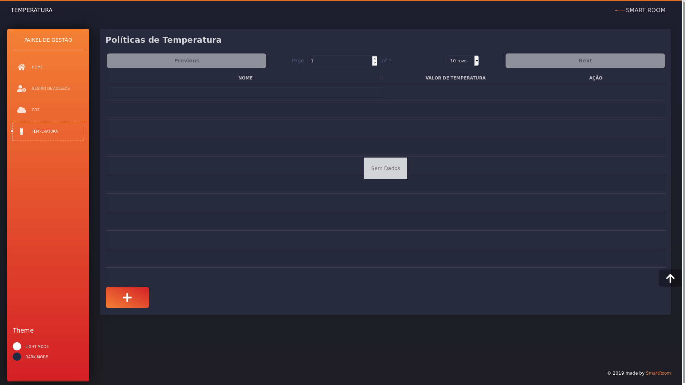
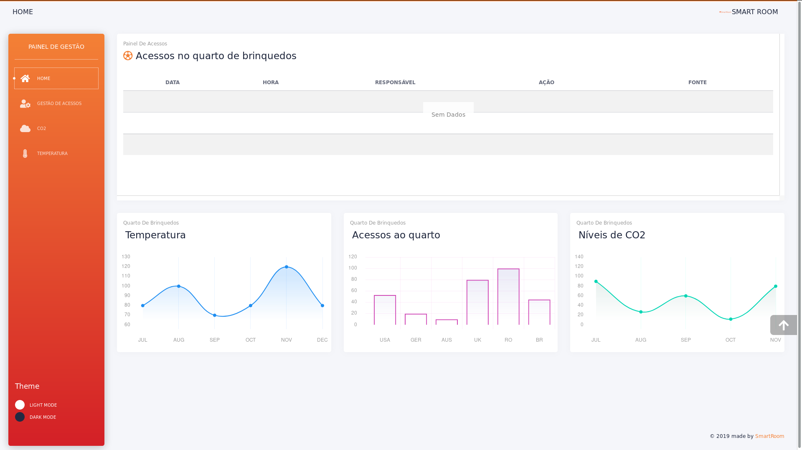

# IES Frontend

A Smart Room é um projeto que se propõe a criar salas inteligentes nas quais será possível monitorização de vários aspetos que vão desde o controlo de acessos às salas, níveis de temperatura a medições de dióxido de carbono, CO2.

Aliado a uma dashboard todos os dados podem ser analisados em gráficos intuitivos que permitem melhor compreender o que se passa na sala, além disso será possível definir algumas preferências do utilizador em relação ao ambiente, podendo personalizar que alertas quer receber, bem como definir que acessos podem ser realizados na sala uma vez que será possível gerir quais os cartões autorizados ou não

## Autores
* **Team Manager**  - [Rui Coelho](https://github.com/user-cube)
* **Product Owner**  - [Jean Brito](https://github.com/JoelBrito13)
* **Architect** - [Luís Costa](https://github.com/lmcosta98)
* **DevOps master** - [Pedro Candoso](https://github.com/PBCandoso)

## Repositórios de referência:
* [Repostório de referência](https://github.com/user-cube/Smart_Room)
* [Frontend](https://github.com/user-cube/ies_frontend)

### Justificação da utilização de vários repostórios
Tal como foi definido na arquitetura do projeto, dissemos que íamos criar uma pwa baseada na aplicação web, para a criação de uma pwa, a Google exige:
* Seja acessível nos seus servidores de criação
* Esteja em HTTPS
* Quando feita em react usar a versão `production build`
Para que isto seja feito, um container na VM que nos foi fornecida não permite que a mesma seja criada.

## Frontend
Este repositório tem integração CI/CD. A parte de CI é tratada pelo Github Actions e a parte de CD é tratada pelo Heroku, podendo ser a aplicação web encontrada <a href="https://iesfrontend.herokuapp.com/login" target='_blank'>aqui</a>.

### Especificação
* Desenvolvido em React + Node;
* Contém PWA;
* Necssita de credenciais para o login.

### Estado do frontend

