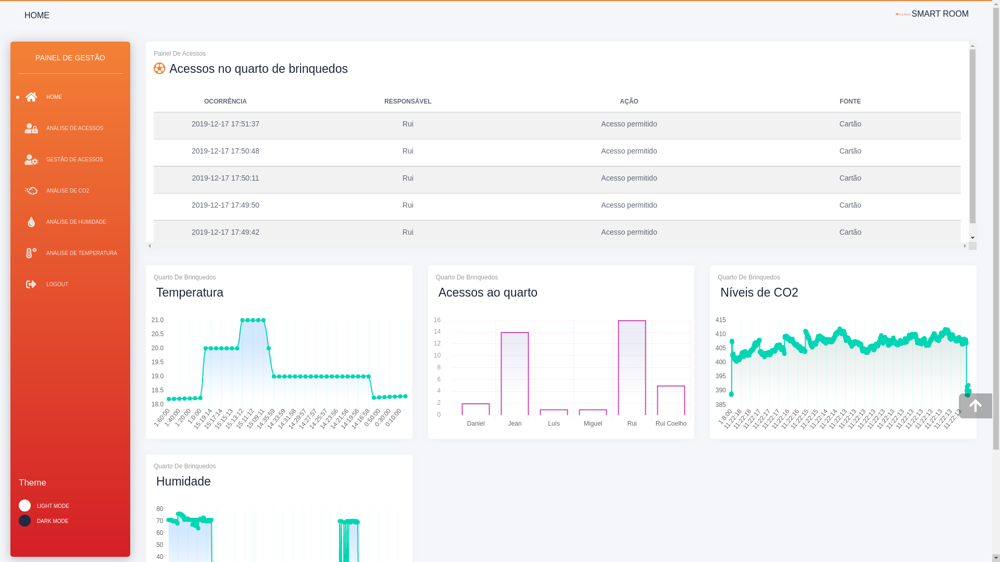

# IES Frontend

A Smart Room é um projeto que se propõe a criar salas inteligentes nas quais será possível monitorização de vários aspetos que vão desde o controlo de acessos às salas, níveis de temperatura a medições de dióxido de carbono, CO2.

Aliado a uma dashboard todos os dados podem ser analisados em gráficos intuitivos que permitem melhor compreender o que se passa na sala, além disso será possível definir algumas preferências do utilizador em relação ao ambiente, podendo personalizar que alertas quer receber, bem como definir que acessos podem ser realizados na sala uma vez que será possível gerir quais os cartões autorizados ou não

## Autores
* **Team Manager**  - [Rui Coelho](https://github.com/user-cube)
* **Product Owner**  - [Jean Brito](https://github.com/JoelBrito13)
* **Architect** - [Luís Costa](https://github.com/lmcosta98)
* **DevOps master** - [Pedro Candoso](https://github.com/PBCandoso)

## Repositórios de referência:
* [Repostório de referência](https://github.com/user-cube/Smart_Room)
* [Frontend](https://github.com/user-cube/ies_frontend)

## Links

### Backlog
Para o backlog optamos pelo Pivotal Tracker o mesmo pode ser acedido <a href="https://www.pivotaltracker.com/n/projects/2410465">aqui</a>.

### Documentos
Os documentos do projeto podem ser encontrados na pasta da Google Drive, contém sempre a versão mais atualizada dos mesmos uma vez que a ferramenta definida para a escrita de relatórios foi o Google Docs, a pasta encontra-se <a href="https://drive.google.com/drive/folders/1Q3gWHAxaBDn8KbCLEB_KCepWUc4GiT_G?usp=sharing">aqui</a>.

## Front-End

